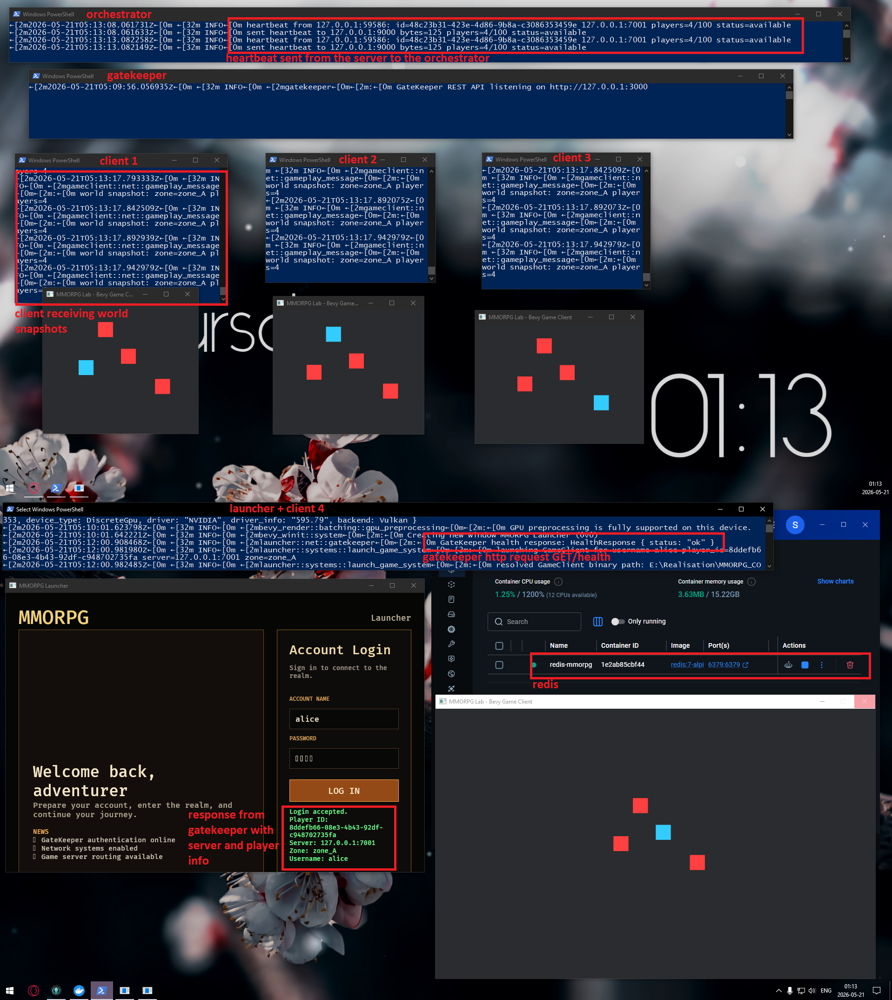

# MMORPG — Cours Réseaux / Network Programming Course

> **Par / By:** Nathanael Tremblay — TREN19089806

---

## Français

### Description

MMO à architecture multi-serveurs réalisé dans le cadre du cours de programmation
réseau avancée en jeux vidéo.

### Lancer le projet (Bevy + serveurs)

```powershell
.\run_all.ps1
```

Attendre que tout soit compilé avant d'effectuer une requête.
Une bonne référence est d'attendre l'apparition du **heartbeat** dans le terminal
de l'Orchestrator.

### Architecture

| Composant | Rôle |
|---|---|
| `Broker` | Routage pub/sub des messages réseau |
| `GateKeeper` | Authentification HTTP + Redis |
| `Orchestrator` | Supervision et scaling des processus |
| `GameServer` | Logique de jeu, heartbeat, AoI |
| `SpatialService` | QuadTree, handoff inter-shards |
| `GameClient` | Client Bevy (ECS, rendu, input) |
| `GodotClient` | **Client Godot 4.6 (GDExtension Rust)** |
| `Launcher` | Interface de connexion / login |
| `Shared` | Protocoles partagés (encode/decode) |

---

### Client Godot 4.6

Le répertoire `GodotClient/` contient un projet Godot 4.6 dont la logique réseau
est écrite en Rust via **GDExtension** (crate `mmo_client`).

#### Prérequis

- [Rust & Cargo](https://rustup.rs/)
- Git
- `curl` (disponible nativement sur Windows 10+, macOS, Linux)

#### Installation — première fois

> ⚠️ Toutes les commandes `cargo xtask` doivent être exécutées **depuis le répertoire `GodotClient/`**.

```powershell
cd GodotClient
cargo xtask setup
```

Cette commande **télécharge automatiquement** Godot 4.6 depuis les releases
officielles et le place dans `GodotClient/.godot_bin/` (**ignoré par Git**).
Chaque membre de l'équipe exécute cette commande une seule fois.

#### Développement quotidien

```powershell
# Compiler la GDExtension Rust + ouvrir l'éditeur Godot
cargo xtask editor

# Compiler + lancer le jeu directement (sans éditeur)
cargo xtask run
```

#### Build release / export

```powershell
cargo xtask package
# → builds/mmo_client.exe
```

#### Structure du projet Godot

```
GodotClient/
├── .gitignore          # exclut .godot_bin/, builds/, bin/*.dll
├── game/
│   ├── project.godot
│   ├── bin/            # .dll/.so GDExtension (auto-généré, gitignored)
│   ├── mmo_client.gdextension  (auto-généré par xtask)
│   └── scenes/
│       ├── world.tscn              # scène principale
│       ├── player.gd               # contrôleur joueur local
│       ├── entity_registry.gd      # gestionnaire entités distantes
│       ├── autoloads/
│       │   └── NetworkClient.gd    # singleton réseau
│       └── ui/
│           └── shard_boundary_debug.gd  # visualisation grille shards
└── rust/
    ├── Cargo.toml
    ├── src/
    │   ├── lib.rs          # point d'entrée GDExtension
    │   ├── network/mod.rs  # client TCP async (Tokio) + reconnexion
    │   ├── world/mod.rs    # EntityRegistry + interpolation
    │   └── ui/mod.rs       # HUD + ShardBoundaryDebug (@tool)
    └── xtask/              # automatisation du build
```

#### Signaux Rust → GDScript

| Signal | Paramètres | Émis quand |
|---|---|---|
| `position_received` | `client_id: i64, x: f32, y: f32` | mise à jour de position reçue |
| `player_joined` | `client_id: i64` | nouveau joueur dans la zone |
| `player_left` | `client_id: i64` | joueur parti / déconnecté |

#### Fonctions GDScript → Rust

| Fonction | Description |
|---|---|
| `send_position(x, y)` | Envoie la position locale au serveur |
| `set_client_id(id)` | Définit l'ID authentifié après login |
| `set_server_addr(addr)` | Change l'adresse serveur avant `_ready()` |

---

### Test du multijoueur et des shards

#### Prérequis

- **Docker** en cours d'exécution (pour Redis)
- Workspace compilé : `cargo build` depuis la racine
- Godot installé : `cargo xtask setup` depuis `GodotClient/`

#### 1 — Lancer tous les serveurs

```powershell
# Racine du projet
.\run_all.ps1
```

Attendre le **heartbeat** dans la fenêtre Orchestrator :
```
[INFO] heartbeat received from gameserver @ 127.0.0.1:7001
```

#### 2 — Lancer le Broker

```powershell
# Nouveau terminal PowerShell
.\target\debug\broker.exe
```

#### 3 — Lancer le SpatialService

```powershell
# Nouveau terminal PowerShell
$env:SPATIAL_HOST         = "127.0.0.1"
$env:SPATIAL_LISTEN_PORT  = "9500"
$env:BROKER_HOST          = "127.0.0.1"
$env:BROKER_PORT          = "9600"
$env:WORLD_HALF_SIZE      = "2048"
$env:QUAD_TREE_MAX_DEPTH  = "2"
$env:CROSSING_MARGIN      = "100"
.\target\debug\spatial_service.exe
```

`QUAD_TREE_MAX_DEPTH=2` crée une grille **2×2 = 4 shards**, idéale pour tester le handoff.

#### 4 — Lancer deux clients Godot

**Client 1** — terminal A :
```powershell
cd GodotClient
cargo xtask run
```

**Client 2** — terminal B (changer l'`id` dans `scenes/player.gd` avant) :
```gdscript
# player.gd — ligne 9
var my_client_id: int = 2   # 1 pour le client A, 2 pour le client B
```
```powershell
cd GodotClient
cargo xtask run
```

#### 5 — Ce qu'il faut observer

| Action | Résultat attendu |
|---|---|
| Démarrage | HUD affiche `Disconnected` puis `Connected` |
| Déplacement (flèches ou WASD) | `Position` et `Shard` dans le HUD se mettent à jour |
| Client B visible par A | `Entities: 1` apparaît dans le HUD du client A |
| Traverser `x ≈ 2048` ou `y ≈ 2048` | `Shard` passe de `shard_0` → `shard_1` (ou autre) |
| Logs SpatialService sur traversée | `crossing alert`, `handoff request`, `handoff ack` |

#### 6 — Ports de référence

| Service | Port |
|---|---|
| Redis | `6379` |
| GateKeeper (HTTP) | `3000` |
| Orchestrator | `9000` |
| GameServer (shard 0) | `7001` |
| Broker | `9600` |
| SpatialService | `9500` |

#### Identifiants de test (GateKeeper)

```
username : alice   (ou n'importe quelle valeur non vide)
password : 1234
```

---



---

## English

### Description

A multi-server MMO built for the Advanced Network Programming in Video Games course.

### Running the project (Bevy servers)

```powershell
.\run_all.ps1
```

Wait for everything to compile before sending requests.
A reliable indicator is the **heartbeat** appearing in the Orchestrator terminal.

### Architecture

| Component | Role |
|---|---|
| `Broker` | Pub/sub message routing |
| `GateKeeper` | HTTP authentication + Redis |
| `Orchestrator` | Process supervision and scaling |
| `GameServer` | Game logic, heartbeat, Area of Interest |
| `SpatialService` | QuadTree, inter-shard handoff pipeline |
| `GameClient` | Bevy client (ECS, rendering, input) |
| `GodotClient` | **Godot 4.6 client (Rust GDExtension)** |
| `Launcher` | Login / connection UI |
| `Shared` | Shared protocol definitions (encode/decode) |

---

### Godot 4.6 Client

The `GodotClient/` directory contains a Godot 4.6 project whose networking layer
is written in Rust via **GDExtension** (crate `mmo_client`).

#### Prerequisites

- [Rust & Cargo](https://rustup.rs/)
- Git
- `curl` (natively available on Windows 10+, macOS, Linux)

#### First-time setup

> ⚠️ All `cargo xtask` commands must be run from inside the **`GodotClient/`** directory.

```powershell
cd GodotClient
cargo xtask setup
```

This command **automatically downloads** Godot 4.6 from the official GitHub releases
and places it in `GodotClient/.godot_bin/` (**gitignored**).
Each team member runs this command once.

#### Day-to-day development

```powershell
# Compile the Rust GDExtension + open the Godot editor
cargo xtask editor

# Compile + launch the game directly (no editor)
cargo xtask run
```

#### Release build / export

```powershell
cargo xtask package
# → builds/mmo_client.exe
```

#### Godot project structure

```
GodotClient/
├── .gitignore          # excludes .godot_bin/, builds/, bin/*.dll
├── game/
│   ├── project.godot
│   ├── bin/            # GDExtension .dll/.so (auto-generated, gitignored)
│   ├── mmo_client.gdextension  (auto-generated by xtask)
│   └── scenes/
│       ├── world.tscn              # main scene
│       ├── player.gd               # local player controller
│       ├── entity_registry.gd      # remote entity manager
│       ├── autoloads/
│       │   └── NetworkClient.gd    # network singleton
│       └── ui/
│           └── shard_boundary_debug.gd  # shard grid visualiser
└── rust/
    ├── Cargo.toml
    ├── src/
    │   ├── lib.rs          # GDExtension entry point
    │   ├── network/mod.rs  # async TCP client (Tokio) + reconnect back-off
    │   ├── world/mod.rs    # EntityRegistry + position interpolation
    │   └── ui/mod.rs       # HUD labels + ShardBoundaryDebug (@tool)
    └── xtask/              # build automation
```

#### Rust → GDScript signals

| Signal | Parameters | Emitted when |
|---|---|---|
| `position_received` | `client_id: i64, x: f32, y: f32` | a position update is received |
| `player_joined` | `client_id: i64` | a new player enters the AoI |
| `player_left` | `client_id: i64` | a player leaves or disconnects |

#### GDScript → Rust functions

| Function | Description |
|---|---|
| `send_position(x, y)` | Sends the local player position to the server |
| `set_client_id(id)` | Sets the authenticated client id after login |
| `set_server_addr(addr)` | Overrides the server address before `_ready()` |

#### Thread-safety notes

- The Tokio runtime runs on its **own OS thread** — the Godot main thread is never blocked.
- `inbox` / `outbox` are `Arc<Mutex<Vec<…>>>` — safe to share across threads.
- Reconnection uses **exponential back-off** (1 s → 2 s → … → 32 s, then constant).
- `bin/` and `.godot_bin/` are gitignored — run `cargo xtask setup` on each machine.

---

### Multiplayer & shard testing procedure

#### Prerequisites

- **Docker** running (for Redis)
- Workspace compiled: `cargo build` from the project root
- Godot installed: `cargo xtask setup` from `GodotClient/`

#### 1 — Start all servers

```powershell
# From the project root
.\run_all.ps1
```

Wait for the **heartbeat** to appear in the Orchestrator window:
```
[INFO] heartbeat received from gameserver @ 127.0.0.1:7001
```

#### 2 — Start the Broker

```powershell
# New PowerShell terminal
.\target\debug\broker.exe
```

#### 3 — Start the SpatialService

```powershell
# New PowerShell terminal
$env:SPATIAL_HOST         = "127.0.0.1"
$env:SPATIAL_LISTEN_PORT  = "9500"
$env:BROKER_HOST          = "127.0.0.1"
$env:BROKER_PORT          = "9600"
$env:WORLD_HALF_SIZE      = "2048"
$env:QUAD_TREE_MAX_DEPTH  = "2"
$env:CROSSING_MARGIN      = "100"
.\target\debug\spatial_service.exe
```

`QUAD_TREE_MAX_DEPTH=2` creates a **2×2 = 4 shard** grid — ideal for handoff testing.

#### 4 — Launch two Godot clients

**Client 1** — terminal A:
```powershell
cd GodotClient
cargo xtask run
```

**Client 2** — terminal B (change the id in `scenes/player.gd` first):
```gdscript
# player.gd — line 9
var my_client_id: int = 2   # 1 for client A, 2 for client B
```
```powershell
cd GodotClient
cargo xtask run
```

#### 5 — Expected behaviour

| Action | Expected result |
|---|---|
| Startup | HUD shows `Disconnected` then `Connected` |
| Arrow keys / WASD movement | `Position` and `Shard` in the HUD update in real time |
| Client B visible from A | `Entities: 1` appears in client A's HUD |
| Cross `x ≈ 2048` or `y ≈ 2048` | `Shard` changes from `shard_0` → `shard_1` (or equivalent) |
| SpatialService logs on crossing | `crossing alert`, `handoff request`, `handoff ack` |

#### 6 — Port reference

| Service | Port |
|---|---|
| Redis | `6379` |
| GateKeeper (HTTP) | `3000` |
| Orchestrator | `9000` |
| GameServer (shard 0) | `7001` |
| Broker | `9600` |
| SpatialService | `9500` |

#### Test credentials (GateKeeper)

```
username : alice   (any non-empty string)
password : 1234
```

